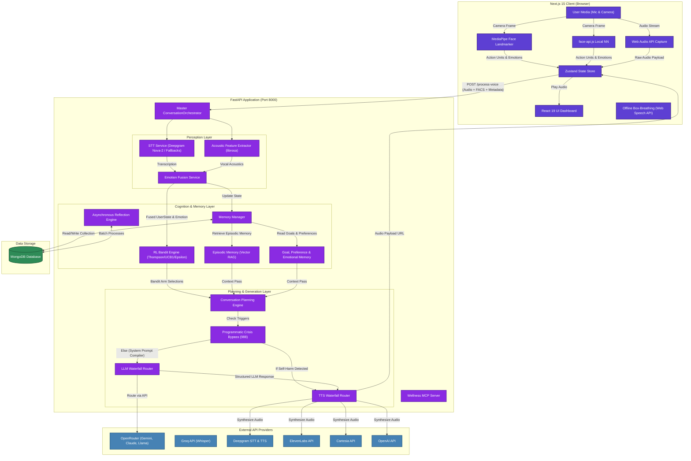

# NeuroNest AI Architecture Diagram

This document contains a comprehensive system architecture diagram of the NeuroNest AI system using Mermaid.js. It details the data flows, processing steps, and integrations between the frontend Next.js 15 client, the FastAPI backend orchestrator, MongoDB, and external API providers.

---

## 🗺️ System Architecture

---

## 🧩 Architectural Breakdown

### 1. Perception Layer
- **MediaPipe & face-api.js**: Calculates facial landmarks and 52 Action Unit intensities locally inside the browser's sandbox to maintain HIPAA/GDPR alignment.
- **Speech-to-Text (STT)**: Utilizes a rate-limit-aware waterfall routing through OpenRouter's transcript endpoint, Groq's Whisper Large, and Deepgram Nova-2.
- **Acoustic Analysis (`librosa`)**: Processes vocal features like pitch variations, volume changes, trembling, and crying metrics on-device or server-side.
- **Emotion Fusion**: Programmatically merges lexical signals, acoustic signals, and visual blendshape markers into a single unified emotional vector.

### 2. Cognition & Memory
- **RL Bandit Engine**: Automatically chooses personality parameters (e.g. persona tone, length, questioning style, detail level) via three concurrently running Multi-Armed Bandit models: Thompson Sampling, Upper Confidence Bound 1 (UCB1), and Epsilon-Greedy.
- **Cognitive RAG Memory**: Organizes state across episodic, goal, preference, emotional, and reflection layers using MongoDB vector cosine similarity searches.
- **Asynchronous Reflection**: Scheduled jobs summarize conversations offline every 5 turns to construct macro-level memory and updates.

### 3. Planning & Generation
- **Conversation Planner**: Programmatically compiles dynamic system prompts, prunes tokens to minimize latency, and checks constraints.
- **Programmatic Crisis Bypass**: A rule-based scanner that immediately intercepts self-harm trigger words and serves pre-compiled safety statements (including the **988 Lifeline**) without calling any LLM.
- **TTS synthesis**: Dynamically routes responses to synthesis engines (ElevenLabs, Cartesia, Deepgram, OpenAI) with dynamic fallback and emotion-specific configuration models.
