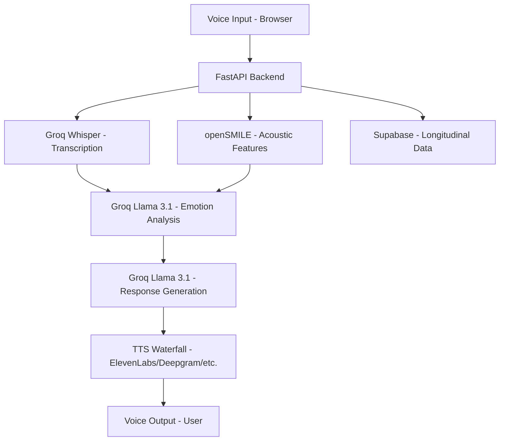

# NeuroNest AI 🧠💜

NeuroNest AI is an emotionally intelligent voice assistant that goes far beyond a standard chatbot. It listens to what you **say** AND how you **sound**, detects if you're hiding your true feelings, and responds with the warmth of a caring, wise mother — using gentle humor to bring you back to a calm, positive state.

> **Built for a Hackathon** · Powered by Groq (Free Tier) · Zero OpenAI Cost

---

## ✨ What Makes It Special

Unlike regular voice assistants, NeuroNest detects **contradiction** between your words and your voice:
- You say: *"I'm fine, everything is okay."*
- But your voice sounds: trembling, whimpering, withdrawn.
- NeuroNest catches this, understands you're hurting, and responds with empathy — not a scripted reply.

If you're **angry, sad, stressed or anxious**, it responds with warmth AND a gentle touch of humor to lift your spirits — like a mom who makes you smile even when you're crying.

---

## 🏗️ Architecture & Pipeline



---

## 🚀 Getting Started

Follow these steps to get the project running locally.

### 1. Clone the Repository
```bash
git clone <your-repo-url>
cd VoiceAssistant
```

### 2. Backend Setup
The backend is built with FastAPI and handles audio processing, emotion detection, and TTS generation.

```bash
cd backend
# Create a virtual environment (optional but recommended)
python -m venv venv
source venv/Scripts/activate  # On Windows: venv\Scripts\activate

# Install dependencies
pip install -r requirements.txt

# Create .env file
# (See Configuration section below for details)
```

**Run the backend:**
```bash
uvicorn main:app --reload --port 8000
```

### 3. Frontend Setup
The frontend is built with React, Vite, and Tailwind CSS.

```bash
cd frontend
# Install dependencies
npm install

# Create .env file
# (See Configuration section below for details)
```

**Run the frontend:**
```bash
npm run dev
```
Open **http://localhost:5173** in your browser.

---

## ⚙️ Configuration (.env)

You need to set up environment variables in both the `backend` and `frontend` directories.

### Backend (`backend/.env`)
Create a file named `.env` in the `backend` folder and add the following keys:

```ini
# --- CORE (Required) ---
GROQ_API_KEY=your_groq_api_key          # Primary for Transcription & LLM
SUPABASE_URL=your_supabase_url
SUPABASE_KEY=your_supabase_service_role_key

# --- FALLBACKS & ALTERNATIVES ---
OPENAI_API_KEY=your_openai_key          # Optional fallback
GEMINI_API_KEY=your_gemini_key          # Optional alternative LLM

# --- TTS PROVIDERS (Waterfall) ---
ELEVENLABS_API_KEY=your_elevenlabs_key
DEEPGRAM_API_KEY=your_deepgram_key
CARTESIA_API_KEY=your_cartesia_key
LMNT_API_KEY=your_lmnt_key
MURF_API_KEY=your_murf_key
```

### Frontend (`frontend/.env`)
Create a file named `.env` in the `frontend` folder:

```ini
VITE_SUPABASE_URL=your_supabase_url
VITE_SUPABASE_ANON_KEY=your_supabase_anon_key
VITE_SUPABASE_PUBLISHABLE_KEY=your_supabase_anon_key
```

---

## 🗃️ Supabase Setup

### 1. SQL Schema
Run this SQL in your Supabase **SQL Editor** to create the necessary tables:

```sql
CREATE TABLE public.users (
    id UUID PRIMARY KEY,
    full_name TEXT, role TEXT,
    created_at TIMESTAMP WITH TIME ZONE DEFAULT timezone('utc', now())
);
CREATE TABLE public.voice_sessions (
    id UUID PRIMARY KEY DEFAULT uuid_generate_v4(),
    user_id UUID REFERENCES public.users(id) ON DELETE CASCADE,
    created_at TIMESTAMP WITH TIME ZONE DEFAULT timezone('utc', now())
);
CREATE TABLE public.voice_logs (
    id UUID PRIMARY KEY DEFAULT uuid_generate_v4(),
    session_id UUID REFERENCES public.voice_sessions(id) ON DELETE CASCADE,
    user_id UUID REFERENCES public.users(id) ON DELETE CASCADE,
    audio_url TEXT, transcript TEXT,
    created_at TIMESTAMP WITH TIME ZONE DEFAULT timezone('utc', now())
);
CREATE TABLE public.audio_features (
    id UUID PRIMARY KEY DEFAULT uuid_generate_v4(),
    voice_log_id UUID REFERENCES public.voice_logs(id) ON DELETE CASCADE,
    pitch_mean FLOAT, jitter FLOAT, loudness FLOAT,
    created_at TIMESTAMP WITH TIME ZONE DEFAULT timezone('utc', now())
);
CREATE TABLE public.emotional_analysis (
    id UUID PRIMARY KEY DEFAULT uuid_generate_v4(),
    voice_log_id UUID REFERENCES public.voice_logs(id) ON DELETE CASCADE,
    emotion TEXT, stress_level FLOAT, emotional_tone TEXT,
    created_at TIMESTAMP WITH TIME ZONE DEFAULT timezone('utc', now())
);
CREATE TABLE public.ai_responses (
    id UUID PRIMARY KEY DEFAULT uuid_generate_v4(),
    voice_log_id UUID REFERENCES public.voice_logs(id) ON DELETE CASCADE,
    response_text TEXT, tts_audio_url TEXT,
    created_at TIMESTAMP WITH TIME ZONE DEFAULT timezone('utc', now())
);

-- Create a dummy user for testing
INSERT INTO public.users (id, full_name, role)
VALUES ('00000000-0000-0000-0000-000000000000', 'Test User', 'patient')
ON CONFLICT (id) DO NOTHING;
```

### 2. Storage Buckets
Create two **Public** Storage Buckets in Supabase:
1. `voice-recordings`
2. `ai-responses`

---

## 🛠️ Tech Stack

| Component | Technology |
|-----------|-----------|
| **Frontend** | React + Vite + Tailwind CSS |
| **Backend** | FastAPI (Python) |
| **Transcription** | **Groq Whisper Large V3** (free) |
| **Emotion & Response LLM** | **Groq Llama 3.1 8B Instant** (free) |
| **Acoustic Analysis** | openSMILE (eGeMAPS features) |
| **Text-to-Speech** | Waterfall logic (ElevenLabs → Deepgram → Cartesia → LMNT → Murf → Browser) |
| **Database** | Supabase (PostgreSQL) |
| **Storage** | Supabase Storage Buckets |

---

## 💡 TTS Waterfall System
The app uses a robust "Waterfall" logic for TTS to ensure you always get the best possible voice quality without breaking:
1. **ElevenLabs** (Highest Quality)
2. **Deepgram**
3. **Cartesia**
4. **LMNT**
5. **Murf AI**
6. **Browser Web Speech API** (Fallback — free, works offline)

If you don't provide an API key for a service, it will automatically skip to the next one.

---

*Built with ❤️ for a hackathon. All AI processing runs on Groq's free tier — zero OpenAI credits required.*
