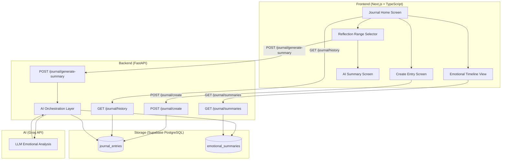
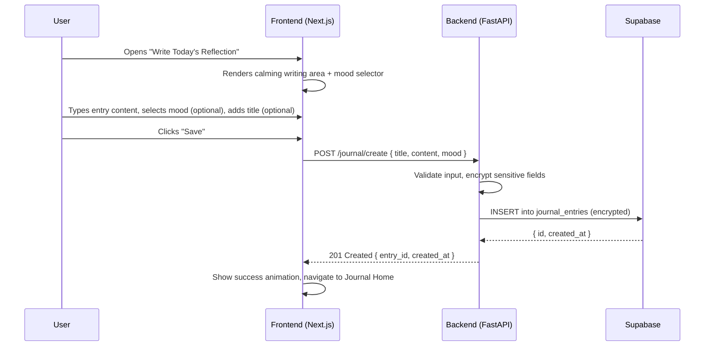
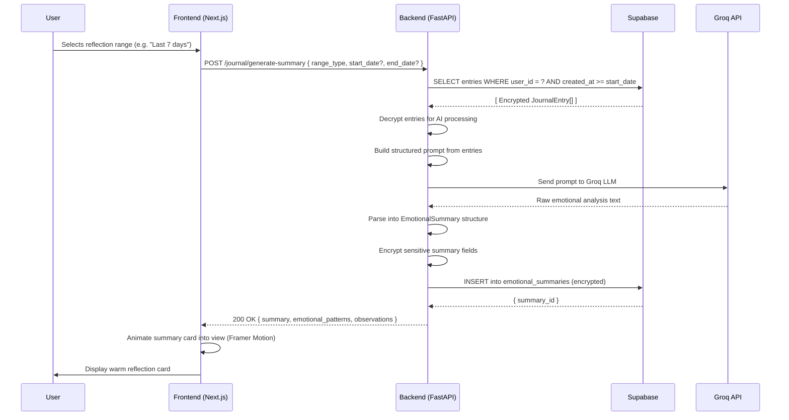

# NeuroNest Reflective Journal Feature

## 📖 Overview

The **Reflective Journal** is a private emotional journaling feature that allows users to:
- Write daily journal entries with mood tracking
- Generate AI-powered emotional summaries using Groq's LLaMA model
- View and manage their journal history and emotional reflections
- All data is encrypted with AES-256-GCM before storage

## 🏗️ Architecture

### High-Level Architecture Diagram



### System Components

```
┌─────────────────┐
│   Next.js       │
│   Frontend      │
│   (Port 3000)   │
└────────┬────────┘
         │
         │ HTTP/REST
         │
┌────────▼────────┐
│   FastAPI       │
│   Backend       │
│   (Port 8000)   │
└────┬───────┬────┘
     │       │
     │       └──────────┐
     │                  │
┌────▼────────┐  ┌──────▼──────┐
│  Supabase   │  │   Groq AI   │
│  PostgreSQL │  │   API       │
└─────────────┘  └─────────────┘
```

### Sequence Diagrams

#### Flow 1: Writing a Journal Entry



#### Flow 2: Generating an AI Emotional Summary



### Tech Stack

**Frontend:**
- Next.js 14.2.3 (React 18)
- TypeScript
- Tailwind CSS
- Framer Motion (animations)
- Zod (validation)

**Backend:**
- FastAPI (Python)
- Supabase Python Client
- Groq AI SDK
- Cryptography (AES-256-GCM encryption)

**Database:**
- Supabase (PostgreSQL)

**AI:**
- Groq API (LLaMA 3.1 8B Instant model)

## 🗄️ Database Schema

### Tables

#### `journal_entries`
Stores encrypted journal entries per user.

| Column      | Type         | Description                              |
|-------------|--------------|------------------------------------------|
| id          | UUID         | Primary key                              |
| user_id     | UUID         | User identifier                          |
| title       | TEXT         | Encrypted entry title (nullable)         |
| content     | TEXT         | Encrypted entry content (required)       |
| mood        | TEXT         | Encrypted mood value (nullable)          |
| created_at  | TIMESTAMPTZ  | Entry creation timestamp                 |

**Index:** `idx_journal_entries_user_created` on `(user_id, created_at)`

#### `emotional_summaries`
Stores AI-generated emotional reflection summaries.

| Column                 | Type         | Description                              |
|------------------------|--------------|------------------------------------------|
| id                     | UUID         | Primary key                              |
| user_id                | UUID         | User identifier                          |
| selected_range         | JSONB        | Date range metadata (plaintext)          |
| generated_summary      | TEXT         | Encrypted summary text                   |
| emotional_patterns     | TEXT         | Encrypted JSON array                     |
| positive_observations  | TEXT         | Encrypted JSON array                     |
| gentle_insights        | TEXT         | Encrypted JSON array                     |
| created_at             | TIMESTAMPTZ  | Summary creation timestamp               |

### SQL Schema

```sql
-- journal_entries table
CREATE TABLE journal_entries (
  id          UUID        PRIMARY KEY DEFAULT gen_random_uuid(),
  user_id     UUID        NOT NULL,
  title       TEXT,
  content     TEXT        NOT NULL,
  mood        TEXT,
  created_at  TIMESTAMPTZ NOT NULL DEFAULT now()
);

CREATE INDEX idx_journal_entries_user_created
  ON journal_entries (user_id, created_at);

-- emotional_summaries table
CREATE TABLE emotional_summaries (
  id                    UUID        PRIMARY KEY DEFAULT gen_random_uuid(),
  user_id               UUID        NOT NULL,
  selected_range        JSONB       NOT NULL,
  generated_summary     TEXT        NOT NULL,
  emotional_patterns    TEXT        NOT NULL DEFAULT '',
  positive_observations TEXT        NOT NULL DEFAULT '',
  gentle_insights       TEXT        NOT NULL DEFAULT '',
  created_at            TIMESTAMPTZ NOT NULL DEFAULT now()
);
```

### Encryption

All sensitive fields are encrypted using **AES-256-GCM** with:
- Per-user key derivation using HKDF-SHA256
- Fresh IV (Initialization Vector) for each encryption
- Authentication tag for integrity verification

## 🚀 Setup Instructions

### Prerequisites

- Node.js 18+ and npm
- Python 3.10+
- Supabase account
- Groq API account

### 1. Clone the Repository

```bash
git clone https://github.com/PraVarSakSidMay/NeuroNest.git
cd NeuroNest
git checkout reflective-journal
```

### 2. Database Setup

1. Go to your [Supabase Dashboard](https://supabase.com/dashboard)
2. Navigate to **SQL Editor**
3. Run the migration script from `supabase/migrations/DEMO_SETUP.sql`

```sql
-- Copy and paste the contents of DEMO_SETUP.sql
-- This creates the journal_entries and emotional_summaries tables
```

### 3. Backend Setup

```bash
cd backend

# Create virtual environment (optional but recommended)
python -m venv venv
source venv/bin/activate  # On Windows: venv\Scripts\activate

# Install dependencies
pip install -r requirements.txt

# Create .env file
cp .env.example .env
```

Edit `backend/.env` with your credentials:

```env
# Supabase Configuration
SUPABASE_URL=https://your-project.supabase.co
SUPABASE_SERVICE_ROLE_KEY=your_service_role_key

# JWT Secret (from Supabase Settings > API)
SUPABASE_JWT_SECRET=your_jwt_secret

# Encryption (generate a secure 32-byte key)
ENCRYPTION_MASTER_KEY=your_base64_encoded_32_byte_key

# Groq AI API Key
GROQ_API_KEY=your_groq_api_key

# Frontend URL
FRONTEND_URL=http://localhost:3000
```

**Generate Encryption Key:**
```bash
python -c "import secrets, base64; print(base64.b64encode(secrets.token_bytes(32)).decode())"
```

**Start the backend:**
```bash
python -m uvicorn main:app --reload --host 0.0.0.0 --port 8000
```

### 4. Frontend Setup

```bash
cd ..  # Back to project root

# Install dependencies
npm install

# Create .env.local file
cp .env.local.example .env.local
```

Edit `.env.local` with your credentials:

```env
NEXT_PUBLIC_SUPABASE_URL=https://your-project.supabase.co
NEXT_PUBLIC_SUPABASE_ANON_KEY=your_anon_key
NEXT_PUBLIC_API_URL=http://localhost:8000
```

**Start the frontend:**
```bash
npm run dev
```

### 5. Access the Application

Open your browser and navigate to:
- **Frontend:** http://localhost:3000
- **Backend API Docs:** http://localhost:8000/docs

## 📱 Features

### 1. Create Journal Entries
- Write daily reflections with optional titles
- Select mood from 6 options (Calm, Stressed, Tired, Happy, Anxious, Overwhelmed)
- Character counter with visual feedback
- Automatic encryption before storage

### 2. View Journal Timeline
- Separate tabs for "Journal Entries" and "Emotional Summaries"
- Chronological display with newest first
- Delete functionality for both entries and summaries
- Empty state with helpful prompts

### 3. Generate Emotional Summaries
- Select reflection period:
  - Last 3 Days
  - Last 5 Days
  - Last 7 Days
  - Last 30 Days
  - Custom date range
- AI analyzes entries and generates:
  - Emotional summary text
  - Emotional patterns
  - Positive observations
  - Gentle insights
- Diagnostic language filtering for safety

### 4. Security Features
- **Demo Mode:** No authentication required (for feature demonstration)
- **Encryption:** All sensitive data encrypted with AES-256-GCM
- **Per-user keys:** Derived using HKDF-SHA256
- **CORS protection:** Configured for localhost development

## 🔌 API Endpoints

### Journal Entries

| Method | Endpoint                    | Description              |
|--------|----------------------------|--------------------------|
| POST   | `/journal/create`          | Create a journal entry   |
| GET    | `/journal/history`         | Get all entries          |
| DELETE | `/journal/entry/{id}`      | Delete an entry          |

### Emotional Summaries

| Method | Endpoint                    | Description              |
|--------|----------------------------|--------------------------|
| POST   | `/journal/generate-summary`| Generate AI summary      |
| GET    | `/journal/summaries`       | Get all summaries        |
| DELETE | `/journal/summary/{id}`    | Delete a summary         |

## 🧪 Testing

### Manual Testing Checklist

- [ ] Create a journal entry with title, content, and mood
- [ ] View the entry in the journal timeline
- [ ] Create multiple entries over different days
- [ ] Generate an emotional summary for "Last 3 Days"
- [ ] View the generated summary in the summaries tab
- [ ] Delete a journal entry
- [ ] Delete an emotional summary
- [ ] Test with empty states (no entries, no summaries)

### API Testing

Use the FastAPI interactive docs at `http://localhost:8000/docs` to test endpoints directly.

## 🔒 Security Considerations

### For Production Deployment

1. **Enable Authentication:**
   - Remove demo mode from `backend/dependencies/auth.py`
   - Uncomment production JWT validation code
   - Update `src/middleware.ts` to enforce authentication

2. **Enable RLS (Row Level Security):**
   - Run `supabase/migrations/001_journal_schema.sql` instead of `DEMO_SETUP.sql`
   - This adds foreign key constraints and RLS policies

3. **Environment Variables:**
   - Never commit `.env` or `.env.local` files
   - Use environment variable management (e.g., Vercel, Railway)
   - Rotate encryption keys regularly

4. **CORS Configuration:**
   - Update `backend/main.py` to allow only your production domain
   - Remove `allow_origins=["*"]` and specify exact origins

## 📝 Development Notes

### Demo Mode

This feature is currently in **demo mode** for easy testing:
- No authentication required
- Uses a hardcoded demo user ID: `00000000-0000-0000-0000-000000000001`
- RLS policies are disabled
- CORS allows all origins

### AI Model

- Uses Groq's `llama-3.1-8b-instant` model
- Context limit: 6000 characters
- Temperature: 0.7 for balanced creativity
- Includes diagnostic language blocklist (26 terms)

### File Structure

```
.
├── backend/
│   ├── dependencies/
│   │   └── auth.py              # Authentication (demo mode)
│   ├── models/
│   │   └── journal.py           # Pydantic models
│   ├── routers/
│   │   └── journal.py           # API endpoints
│   ├── services/
│   │   ├── ai_orchestrator.py  # Groq AI integration
│   │   ├── encryption.py        # AES-256-GCM encryption
│   │   └── range.py             # Date range resolver
│   ├── database.py              # Supabase client
│   ├── main.py                  # FastAPI app
│   └── requirements.txt         # Python dependencies
│
├── src/
│   ├── app/
│   │   ├── journal/
│   │   │   ├── create/
│   │   │   │   └── page.tsx    # Create entry page
│   │   │   ├── reflect/
│   │   │   │   └── page.tsx    # Generate summary page
│   │   │   └── page.tsx        # Journal home (timeline)
│   │   ├── login/
│   │   │   └── page.tsx        # Login page (demo)
│   │   ├── layout.tsx          # Root layout
│   │   └── page.tsx            # Home redirect
│   ├── components/
│   │   └── journal/
│   │       ├── EmotionalSummaryCard.tsx
│   │       ├── JournalEditor.tsx
│   │       └── ReflectionRangeSelector.tsx
│   ├── lib/
│   │   ├── journal-api.ts      # API client
│   │   ├── supabase.ts         # Supabase client
│   │   └── utils.ts            # Utilities
│   ├── types/
│   │   └── journal.ts          # TypeScript types
│   └── middleware.ts           # Auth middleware (demo)
│
├── supabase/
│   └── migrations/
│       ├── 001_journal_schema.sql      # Production schema
│       └── DEMO_SETUP.sql              # Demo schema
│
├── package.json
├── tsconfig.json
├── tailwind.config.ts
└── next.config.js
```

## 🤝 Contributing

This feature was developed as part of the NeuroNest project. For questions or improvements, please open an issue or pull request.

## 📄 License

This project is part of NeuroNest and follows the same license.

## 🙏 Acknowledgments

- **Groq AI** for providing fast LLM inference
- **Supabase** for database and authentication infrastructure
- **Next.js** and **FastAPI** for excellent developer experience
